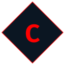

# Introduction

<div align="center">
   [](https://www.carlosmartoz.com/)

   <h3 align="center">Carlos Martínez</h3>

   <p align="center">
      My personal portfolio to collect my experience and work.
   </p>
</div>

## Tecnologies


## 🛠 Installation

1. Install dependencies

   ```sh
   npm install
   ```

## 🛠 Development

2. Start the development server

   ```sh
   npm run dev
   ```

## 🚀 Production

3. Generate a production build

   ```sh
   npm run build
   ```
